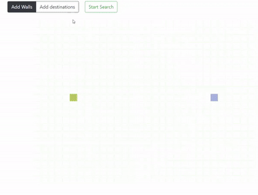

# Path Finding
This is a path finding visualizer to help the mars rover(s) navigate, and find shortest path to the destination(s).

# Algorithms used
Dijikstra's Algorithm : guarantees the shortest path
A* search :arguably the best pathfinding algorithm; uses heuristics to guarantee the shortest path much faster than Dijkstra's Algorithm.

Add multiple sources/destinations.
Click and drag to add walls or to change the position of start and end nodes. 
(About Drifts)
Add random walls to make it more fun.
Click and see the description if you are lost.
Start search and look at the path finder do its job.

# Framework-used
React + Nodejs
