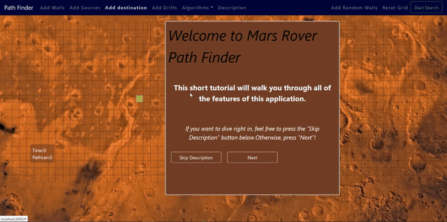

# Path Finding
This is a path finding visualizer for various algorithms [Dijikstra, A*, Breath-First-Search, etc]

Click and drag to add walls or to change the position of start and end nodes. Start search and look at the path finder do its job.

## Framework-used
React + Nodejs
