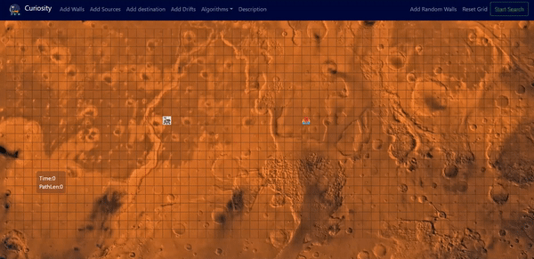

# Path Finding
This is a path finding visualizer to help the mars rover(s) navigate, and find shortest path to the destination(s).

# Algorithms used
Dijikstra's Algorithm : Guarantees the shortest path
A* search :Arguably the best pathfinding algorithm; Uses heuristics to guarantee the shortest path much faster than Dijkstra's Algorithm.

Add multiple sources/destinations.
Click and drag to add walls or to change the position of start and end nodes. 

Drifts are imagined to be air columns. Once you enter a drift node you will be pushed to its end. One can take the drift path if it drifts you along the shortest path or else can avoid these on the whole. Select drifts then click and/or drag to add drift columns. The place your finger lifts from the click marks the end of a single drift column. 

Add random walls to make it more fun.

Click and see the description if you are lost.

Start search and look at the path finder do its job.

# Framework-used
React + Nodejs
